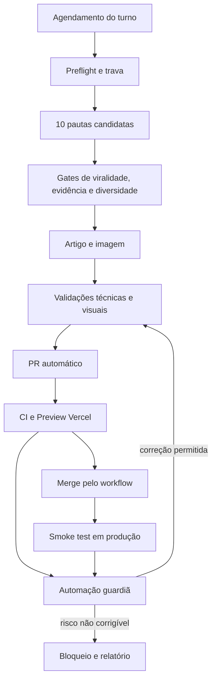

# Plano mestre de automação editorial PulsoByte — duas publicações por dia

**Versão:** 1.0  
**Data da auditoria:** 17 de julho de 2026  
**Fuso editorial:** `America/Sao_Paulo`  
**Repositório:** `ricardooliveirafilho7-hue/PulsoByte`

## 1. Resumo executivo

O objetivo é operar a PulsoByte com duas tentativas automáticas de publicação por dia:

- **edição da manhã:** 06:00;
- **edição da noite:** 20:30;
- **automação guardiã:** verificação horária, atuando somente quando existir uma execução recente, um PR automático ou uma publicação que precise de acompanhamento.

A edição da manhã deve favorecer dicas práticas, guias, comparativos, explicadores e assuntos com utilidade duradoura. A edição da noite deve favorecer novidades confirmadas, acontecimentos do dia, alertas, análises e mudanças com impacto prático. Se não existir notícia suficientemente forte à noite, o sistema escolhe automaticamente outro conteúdo perene, desde que seja claramente diferente da publicação da manhã.

O sistema será **100% automático no sentido operacional**: pesquisar, escolher, escrever, obter e processar a imagem, validar, abrir PR, acompanhar CI, corrigir falhas permitidas, integrar pelo workflow e verificar a produção. Isso não significa prometer que todo artigo será viral ou que falhas externas jamais ocorrerão. Viralidade é probabilística, e serviços como GitHub, fontes externas e Vercel podem falhar. O desenho correto é **fail-closed**: quando existir dúvida factual, jurídica ou técnica, o artigo não é publicado.

A meta operacional é publicar dois artigos por dia. A regra superior é: **não publicar conteúdo fraco ou inseguro apenas para preencher o segundo horário**. Uma execução que decide automaticamente não publicar por falta de qualidade continua sendo uma automação bem-sucedida.

## 2. Estado verificado do projeto

Na auditoria de 17 de julho de 2026, foram confirmados:

- 13 artigos publicados e um rascunho em `content/articles/`;
- imagens locais em `public/images/articles/`;
- Next.js 15, React 19, TypeScript e MDX local;
- branch padrão atual: `claude/pulsobyte-editorial-portal-8klfju`;
- produção da Vercel ligada a essa branch e último deploy de produção em estado `READY`;
- workflow `.github/workflows/automated-content.yml` realizando qualidade, Preview da Vercel, squash merge e exclusão da branch;
- comandos `validate:images`, `typecheck`, `lint` e `build` existentes;
- geração automática de rota, card, metadados, sitemap e relacionados a partir do MDX.

Também foram identificadas lacunas que precisam ser corrigidas **antes** da ativação dos dois horários.

| Achado | Risco | Tratamento obrigatório |
| --- | --- | --- |
| `AGENTS.md` limita a um artigo por dia | A edição noturna seria bloqueada | Alterar para no máximo um artigo por turno e dois por data editorial |
| Não existe identificador de turno no artigo | Reexecuções podem confundir manhã e noite | Adicionar `publicationSlot` e `automationRunId` ao frontmatter automático |
| O workflow confia apenas no prefixo da branch | Uma branch automática poderia alterar código ou workflow e ser integrada | Adicionar allowlist rígida de arquivos e quantidade de alterações |
| CI faz checkout do `head` do PR | Não testa a combinação do conteúdo com a base mais recente | Testar o merge sintético ou bloquear quando a base mudar |
| Validador não exige WebP, 500 KB, licença, URL de crédito ou hash | Imagem inadequada pode passar | Fortalecer `validate-article-images.mjs` |
| GitHub Actions usa Node 20 e Vercel usa Node 24 | Diferença de ambiente pode produzir comportamento divergente | Fixar Node 20.x em local, CI, `package.json` e Vercel |
| Não existe verificação pós-produção | Um merge pode ocorrer sem confirmar a página pública | Adicionar smoke test da URL e do deploy de produção |
| Não existe agendamento editorial da PulsoByte | O workflow só começa depois que um PR é aberto | Criar duas automações editoriais e uma guardiã |
| `robots.ts` não explicita `max-image-preview:large` | Menor preparação para imagens grandes no Discover | Adicionar a diretiva na configuração do Googlebot |
| Artigos atuais têm aproximadamente 165–331 palavras | Novo conteúdo pode herdar profundidade insuficiente | Manter o tom, mas aplicar padrões de profundidade por formato |

## 3. Arquitetura final



Estados oficiais de cada execução:

```text
SCHEDULED → LOCKED → RESEARCHED → SELECTED → DRAFTED → VALIDATED
→ PR_OPEN → CI_RUNNING → PREVIEW_READY → MERGED → PROD_READY → VERIFIED
```

Estados de encerramento seguro:

```text
SKIPPED_NO_STRONG_TOPIC
BLOCKED_DUPLICATE
BLOCKED_SOURCE
BLOCKED_IMAGE
BLOCKED_VALIDATION
BLOCKED_ACCESS
BLOCKED_INFRASTRUCTURE
GUARDIAN_EXHAUSTED
```

## 4. Fase zero — preparação obrigatória do repositório

Antes de criar as automações recorrentes, abrir um PR de infraestrutura separado. Esse PR não publica artigo e deve ser revisado e testado uma única vez.

### 4.1 Atualizar as regras do agente

Substituir a regra “no máximo um artigo por dia” por:

- no máximo um artigo por execução;
- no máximo um artigo no turno `morning`;
- no máximo um artigo no turno `evening`;
- no máximo dois artigos na mesma data editorial;
- a matéria da noite nunca pode reutilizar `topicKey`, evento, produto ou entidade principal da manhã;
- uma falha ou ausência de pauta em um turno não autoriza publicar dois artigos no outro;
- decisões editoriais comuns são automáticas, mas gates eliminatórios nunca podem ser ignorados.

Novo padrão de branch:

```text
automation/artigo-AAAA-MM-DD-manha-slug
automation/artigo-AAAA-MM-DD-noite-slug
```

O padrão continua compatível com o prefixo já reconhecido pelo workflow.

### 4.2 Adicionar identidade de execução ao frontmatter

Todo artigo automático novo deve declarar:

```yaml
publicationSlot: "morning" # morning | evening
automationRunId: "2026-07-18-morning"
topicKey: "entidade-produto-evento-ou-pergunta-central"
primaryEntity: "Nome da principal empresa, produto ou tecnologia"
searchIntent: "informational" # informational | practical | comparison | news | safety
```

Esses campos não precisam aparecer visualmente. Eles servem para idempotência, auditoria e prevenção de duplicidade. O parser ou um validador dedicado deve verificar os valores em artigos automáticos.

### 4.3 Criar validação editorial geral

Adicionar um script `validate:content` usando as dependências já presentes. Ele deve bloquear:

- `automationRunId` duplicado;
- duas matérias no mesmo turno e data;
- mais de duas matérias automáticas na data;
- `publicationSlot` ausente ou inválido;
- data diferente daquela indicada pela branch;
- arquivo cujo nome seja diferente do slug;
- slug, título ou `topicKey` repetido;
- frontmatter inválido;
- categoria ou formato inexistente;
- fonte vazia, duplicada ou sem URL direta;
- links internos inexistentes;
- MDX com componente não registrado;
- artigo sem seção de fontes;
- artigo com extensão incompatível com o formato escolhido;
- título incompatível com o conteúdo;
- uso de expressões proibidas ou afirmações absolutas sem fonte.

### 4.4 Fortalecer a validação de imagens

O `validate-article-images.mjs` deve passar a exigir:

- formato real WebP e extensão `.webp`;
- dimensões-alvo `1600×900`, tolerando somente dimensões maiores em 16:9;
- mínimo absoluto de `1200×675`;
- no máximo 500 KB;
- arquivo decodificável pelo `sharp`;
- perfil de cor normalizado e orientação correta;
- ausência de animação;
- nome idêntico ao slug;
- `coverImageCaption`, `coverImageCredit`, `coverImageCreditUrl`, `coverImageSource`, `coverImageLicense`, `coverImageType` e `coverImagePosition` obrigatórios;
- URL de origem individual, nunca homepage genérica ou resultado de busca;
- SHA-256 diferente de todas as capas já usadas;
- alerta por semelhança perceptual calculada com `sharp`, sem dependência adicional;
- ausência de metadados pessoais desnecessários.

### 4.5 Restringir o que um PR automático pode alterar

Antes de qualquer build, o workflow deve validar o diff. Um PR editorial normal poderá conter somente:

- exatamente um novo `content/articles/*.mdx`;
- exatamente uma nova capa `public/images/articles/*.webp`;
- até três imagens internas, quando justificadas;
- a atualização gerada do manifesto `automation/editorial-catalog.json` (única exceção de modificação, sempre produzida por `npm run catalog:generate` e conferida pelo CI com `validate:catalog`);
- nenhum arquivo apagado;
- nenhuma alteração em `.github/`, `src/`, `package.json`, lockfile, configuração da Vercel, AdSense ou arquivos de segurança.

Uma correção automática posterior poderá editar somente os arquivos já criados pelo mesmo PR. Qualquer alteração fora dessa lista encerra o workflow sem merge.

### 4.6 Alinhar ambientes

Fixar Node 20.x em:

- ambiente do agente;
- GitHub Actions;
- `package.json` por meio de `engines`;
- configuração do projeto na Vercel.

Executar `npm ci` em todos os ambientes. Não usar `npm install` na rotina diária e não atualizar dependências durante uma publicação editorial.

### 4.7 Melhorar preparação para descoberta

O artigo já possui canonical, Open Graph, Twitter Card, JSON-LD e sitemap. A fase zero deve acrescentar:

- `max-image-preview:large` para Googlebot;
- dimensões da capa nos metadados Open Graph;
- verificação de que o JSON-LD usa a capa e as datas corretas;
- teste automático de presença do slug no sitemap gerado.

O Google recomenda conteúdo útil, original, confiável e feito para pessoas; também afirma que publicar grande quantidade apenas para parecer “fresco” não melhora o ranking. Portanto, duas execuções não podem virar produção em massa superficial. [Google — conteúdo útil e people-first](https://developers.google.com/search/docs/fundamentals/creating-helpful-content)

## 5. Disparadores e horários

### 5.1 Horários escolhidos

| Automação | Horário | Função |
| --- | --- | --- |
| PulsoByte — Manhã | 06:00 todos os dias | Conteúdo útil, prático e duradouro |
| PulsoByte — Noite | 20:30 todos os dias | Novidade confirmada, análise ou segundo conteúdo perene diferente |
| Guardião PulsoByte | A cada hora | Acompanhar somente execuções e PRs recentes |

**Por que 20:30 e não 22:00:** 20:30 captura acontecimentos do dia, mas ainda deixa tempo para pesquisa, correção, CI, Preview e verificação antes da virada da data. Às 22:00, uma falha pode atravessar a meia-noite e confundir a identidade editorial.

### 5.2 Configuração sugerida

Manhã:

```text
BEGIN:VEVENT
DTSTART;TZID=America/Sao_Paulo:20260718T060000
RRULE:FREQ=DAILY;BYHOUR=6;BYMINUTE=0;BYSECOND=0
END:VEVENT
```

Noite:

```text
BEGIN:VEVENT
DTSTART;TZID=America/Sao_Paulo:20260718T203000
RRULE:FREQ=DAILY;BYHOUR=20;BYMINUTE=30;BYSECOND=0
END:VEVENT
```

Guardião:

```text
BEGIN:VEVENT
DTSTART;TZID=America/Sao_Paulo:20260718T070000
RRULE:FREQ=HOURLY;INTERVAL=1
END:VEVENT
```

Devem existir duas automações editoriais separadas, com o turno explicitamente informado no prompt. Isso é mais seguro do que uma automação tentar inferir o turno apenas pelo relógio. Ambas devem ler uma única versão canônica do runbook armazenada no repositório, evitando que os prompts da manhã e da noite evoluam de maneira diferente.

Se algum agendamento auxiliar for implementado com GitHub Actions, evitar o minuto zero. O GitHub informa que execuções agendadas podem atrasar ou até ser descartadas em períodos de alta carga, especialmente no início da hora. Ele também suporta timezone IANA e só executa schedules existentes na branch padrão. [GitHub — eventos `schedule`](https://docs.github.com/en/actions/reference/workflows-and-actions/events-that-trigger-workflows#schedule)

## 6. Preflight e trava de idempotência

Cada execução começa em workspace descartável e realiza:

1. Resolver `editorialDate` no fuso `America/Sao_Paulo`.
2. Receber `publicationSlot` fixo da automação.
3. Construir `automationRunId = editorialDate + slot`.
4. Confirmar GitHub autenticado e permissão de push.
5. Consultar a branch padrão pela API; nunca usar `main` fixo.
6. Clonar a versão mais recente ou criar `git worktree` limpo.
7. Confirmar Node 20.x e lockfile npm.
8. Ler integralmente `AGENTS.md`, runbook, README, configurações editoriais, validadores e workflow.
9. Executar `git status --porcelain` e exigir resultado vazio.
10. Procurar o `automationRunId` nos artigos, branches, PRs abertos, PRs fechados e PRs integrados.
11. Procurar outras automações editoriais em andamento.
12. Repetir a checagem imediatamente antes do push.

A trava de duplicidade usa quatro camadas:

- identidade exata: `automationRunId`;
- pauta: `topicKey`;
- entidade/evento: empresa, produto, anúncio ou problema central;
- semântica: comparação entre título, resumo, tags, intenção e perguntas respondidas.

Regras de semelhança:

- mesmo slug, título normalizado, `topicKey`, entidade + evento ou URL primária: bloqueio imediato;
- similaridade semântica acima de 0,82: rejeitar;
- faixa 0,70–0,82: só aceitar se formato, intenção, perguntas respondidas e utilidade forem materialmente diferentes;
- trocar poucas palavras do título nunca transforma uma pauta repetida em nova.

### 6.1 Serialização entre manhã e noite

Às 20:30, o agente deve verificar a execução da manhã:

- se foi integrada, sincronizar novamente a branch padrão e continuar;
- se foi corretamente bloqueada ou pulada, continuar;
- se o PR ainda estiver em CI, falhou ou estiver sem conclusão, a automação guardiã recebe prioridade;
- se o PR matinal continuar aberto às 21:00, a edição noturna é bloqueada para evitar dois PRs construídos sobre bases divergentes.

Segurança e consistência prevalecem sobre o volume.

## 7. Geração e seleção de pautas virais

### 7.1 Descoberta ampla

Cada turno deve produzir internamente **dez pautas candidatas**, distribuídas por no mínimo cinco grupos:

1. novidades e lançamentos confirmados;
2. dicas práticas e produtividade;
3. segurança, privacidade e golpes;
4. comparativos, compras e decisões;
5. tecnologia no Brasil;
6. explicadores e perguntas frequentes;
7. curiosidades e histórias verificáveis;
8. ferramentas, aplicativos e mudanças de plataforma.

Não escolher a primeira notícia encontrada. Primeiro mapear as dez, eliminar as fracas e aprofundar as três finalistas em condições equivalentes.

Fontes de descoberta podem incluir páginas oficiais, changelogs, documentos regulatórios, Google Trends, perguntas recorrentes e jornalismo reconhecido. O Google Trends é apenas um sinal: o próprio Google alerta que um pico não prova que algo “venceu” ou seja universalmente popular. [Google Trends — interpretação dos dados](https://support.google.com/trends/answer/4365533)

### 7.2 Três notas independentes

Uma média geral não pode esconder um problema eliminatório. Toda finalista recebe três notas separadas.

#### Potencial de atenção — mínimo 75/100

| Critério | Peso |
| --- | ---: |
| Atualidade ou momento de interesse | 15 |
| Curiosidade legítima, sem esconder informação essencial | 15 |
| Utilidade prática | 20 |
| Relevância para brasileiros | 15 |
| Potencial de compartilhamento e conversa | 10 |
| Intenção de busca ou tendência confirmável | 10 |
| Originalidade diante do acervo | 10 |
| Potencial visual | 5 |

#### Confiança factual — mínimo 85/100

| Critério | Peso |
| --- | ---: |
| Fonte primária adequada | 25 |
| Duas confirmações realmente independentes | 25 |
| Datas, números e versões confirmados | 20 |
| Brasil e disponibilidade verificados | 15 |
| Contradições e limitações resolvidas | 15 |

#### Qualidade editorial — mínimo 85/100

| Critério | Peso |
| --- | ---: |
| Título entrega exatamente a promessa | 20 |
| Profundidade e valor próprio | 20 |
| Clareza para público brasileiro | 15 |
| Aplicação ou conclusão útil | 15 |
| Estrutura, SEO e escaneabilidade | 15 |
| Tom humano e ausência de linguagem artificial | 10 |
| Integração real com a imagem | 5 |

Uma pauta só vence se superar **as três notas** e todos os gates eliminatórios.

### 7.3 Gates eliminatórios

Rejeitar independentemente da nota quando houver:

- rumor tratado como fato;
- ausência de fonte primária quando ela deveria existir;
- duas matérias copiando a mesma apuração original;
- contradição material não resolvida;
- preço, número, disponibilidade ou data sem confirmação;
- mesma pauta da manhã;
- imagem sem procedência segura;
- título sensacionalista, enganoso ou que explore medo/raiva artificial;
- assunto de saúde, finanças, segurança ou legislação sem padrão reforçado de evidência;
- texto que seria apenas paráfrase de outra reportagem;
- conteúdo produzido apenas para completar o horário.

O Google recomenda títulos que capturem a essência, imagens relevantes e conteúdo oportuno ou com insights únicos; também diz que elegibilidade no Discover não garante distribuição. [Google Discover](https://developers.google.com/search/docs/appearance/google-discover)

### 7.4 Contrato de diversidade entre os dois turnos

O artigo da noite deve obrigatoriamente possuir:

- `topicKey` diferente;
- entidade e produto principais diferentes;
- evento ou pergunta central diferente;
- título e intenção diferentes;
- imagem conceitualmente diferente;
- preferencialmente outro `contentType`.

Estratégia editorial padrão:

- **06:00:** guia, dica prática, explicador ou comparativo com alto valor de salvamento e busca;
- **20:30:** notícia, análise, alerta ou mudança do dia com alto valor de compartilhamento e conversa.

Se o turno noturno usar pauta perene, ela deve ser de outra categoria ou resolver outro problema. Nunca transformar a publicação matinal em “parte 2” automática.

## 8. Pesquisa e verificação factual

Para cada finalista:

1. Identificar a fonte original.
2. Registrar data do evento, data de publicação e data de atualização.
3. Buscar pelo menos duas confirmações independentes para alegações centrais.
4. Confirmar nomes, grafias, números, unidades, preços, versões e países.
5. Confirmar especificamente disponibilidade no Brasil.
6. Diferenciar anúncio, teste, rollout, beta, lançamento e disponibilidade pública.
7. Procurar atualização ou correção posterior.
8. Procurar evidência contrária.
9. Resolver divergências ou reduzir a força da afirmação.
10. Registrar cada fonte realmente usada, com URL direta.

Critério de encerramento:

- uma fonte primária, quando disponível;
- duas fontes independentes para os fatos centrais;
- nenhuma contradição material aberta;
- todas as datas e números críticos confirmados;
- limitações conhecidas;
- informação suficiente para produzir valor original.

Para guias, testar novamente os passos e menus. Para comparativos, usar critérios equivalentes. Para assuntos voláteis, pesquisar de novo imediatamente antes do commit.

## 9. Produção do artigo

### 9.1 Frontmatter

Usar todos os campos exigidos pelo projeto e os novos campos de automação:

```yaml
status: "published"
reviewStatus: "reviewed"
editorialPriority: "standard"
featured: false
author: "Redação PulsoByte"
publicationSlot: "morning"
automationRunId: "AAAA-MM-DD-morning"
topicKey: "..."
primaryEntity: "..."
searchIntent: "practical"
```

`featured: true` não pode ser escolhido automaticamente por padrão. Somente uma pauta excepcional pode ocupar destaque, e o PR deve justificar a decisão.

### 9.2 Profundidade por formato

Faixas recomendadas, sem preenchimento artificial:

- notícia: 800–1.400 palavras;
- guia ou dica: 1.100–2.200;
- explicador: 1.000–1.800;
- comparativo: 1.300–2.400;
- análise: 1.300–2.400;
- curiosidade ou história: 900–1.600.

Cada artigo deve conter:

- resposta principal logo no início;
- três ou quatro pontos rápidos quando fizer sentido;
- contexto suficiente;
- aplicação prática;
- limitações e o que ainda não foi confirmado;
- dois a cinco links internos válidos, quando existirem artigos adequados;
- bloco de fontes;
- conclusão útil e não genérica.

Usar somente componentes MDX registrados. Não criar componente ou dependência durante a rotina editorial.

### 9.3 Título e promessa

Criar pelo menos cinco títulos. Avaliar clareza, precisão, curiosidade, naturalidade, busca e fidelidade ao conteúdo. O vencedor deve ser informativo e atraente, nunca omitir a informação central só para forçar o clique.

O Google considera o título um dos principais elementos usados para a decisão de clique e recomenda texto de alta qualidade, descritivo e coerente com o título principal visível. [Google — title links](https://developers.google.com/search/docs/appearance/title-link)

## 10. Gestão das imagens

### 10.1 Escolha semântica

A imagem recebe uma nota própria de aderência, com mínimo 90/100:

| Critério | Peso |
| --- | ---: |
| Representa diretamente a pauta | 30 |
| Produto, versão, interface ou pessoa corretos | 20 |
| Origem e licença auditáveis | 20 |
| Funciona em corte 16:9 e mobile | 15 |
| Qualidade técnica e ausência de distorções | 10 |
| Não é genérica nem repetitiva | 5 |

Regras:

- produto: imagem oficial do modelo exato;
- aplicativo: screenshot oficial ou captura limpa da interface real;
- empresa: material institucional ligado ao acontecimento;
- comparativo: itens realmente comparados;
- tema genérico: fotografia contextual licenciada;
- tema abstrato: ilustração original sóbria;
- notícia real ou pessoa real: nunca usar representação gerada que pareça documental.

### 10.2 Ordem de obtenção

1. Press kit ou imagem oficial com uso editorial identificado.
2. Imagem oficial do produto ou interface.
3. Screenshot produzido pela PulsoByte, sem dados privados.
4. Wikimedia Commons com conferência individual da licença.
5. Unsplash ou Pexels para temas contextuais.
6. Ilustração original apenas para assunto abstrato.

Unsplash e Pexels permitem amplos usos, mas suas restrições continuam válidas; a PulsoByte deve creditar mesmo quando a atribuição não for obrigatória. No Wikimedia Commons, cada arquivo pode ter exigências diferentes, e deve-se creditar o criador original, não apenas o uploader. [Unsplash License](https://unsplash.com/license), [Pexels License](https://www.pexels.com/license/), [Wikimedia Commons — reutilização](https://commons.wikimedia.org/wiki/Commons:Reusing_content_outside_Wikimedia)

### 10.3 Processamento e inspeção

1. Baixar o original.
2. Conferir MIME e decodificação.
3. Remover metadados pessoais.
4. Corrigir orientação e cor.
5. Recortar conscientemente para 16:9.
6. Redimensionar para 1600×900.
7. Converter para WebP.
8. Comprimir para menos de 500 KB sem destruir detalhes.
9. Salvar com o slug.
10. Calcular SHA-256 e semelhança perceptual.
11. Validar foco em 1440, 1024, 430, 375 e 320 px.
12. Confirmar que título, legenda, alt e imagem descrevem o mesmo assunto.

Imagens grandes e relevantes aumentam a chance de boa apresentação no Discover. O Google recomenda pelo menos 1200 px, alta resolução, corte adequado, imagem representativa e `max-image-preview:large`; também recomenda alt descritivo, sem repetição artificial de palavras-chave. [Google Discover](https://developers.google.com/search/docs/appearance/google-discover), [Google Image SEO](https://developers.google.com/search/docs/appearance/google-images)

## 11. Validações antes do PR

### 11.1 Camada editorial

- promessa do título respondida;
- introdução direta;
- fatos separados de análise;
- fontes ligadas às afirmações;
- datas, preços e versões confirmados;
- Brasil mencionado somente com evidência;
- sem repetições, frases vazias ou tom artificial;
- conclusão prática;
- conteúdo diferente do turno anterior;
- notas mínimas mantidas após a redação.

### 11.2 Camada estrutural

- YAML válido;
- campos obrigatórios presentes;
- `publicationSlot` e `automationRunId` coerentes;
- slug único e igual ao nome do arquivo;
- categoria, formato e componentes válidos;
- MDX compilável;
- links internos existentes;
- fontes externas diretas e acessíveis;
- nenhuma URL de busca ou homepage usada no lugar da fonte original.

### 11.3 Camada técnica

Executar com Node 20:

```bash
npm ci
npm run validate:content
npm run validate:images
npm run typecheck
npm run lint
npm run build
```

Depois:

```bash
git diff --check
git status --short
```

Realizar busca de segredos e confirmar que não existem tokens, cookies, chaves, e-mails privados ou arquivos `.env` no diff.

### 11.4 Camada visual

Abrir o build local e verificar:

- home;
- lista de artigos;
- categoria;
- artigo novo;
- relacionados;
- sitemap;
- desktop 1440 px;
- mobile 430 e 320 px;
- corte da capa;
- tabelas e componentes MDX;
- overflow horizontal;
- hierarquia de título;
- fontes e créditos;
- ausência de layout vazio causado por anúncio.

Gerar screenshots temporários para auditoria da execução. Eles não entram no commit.

### 11.5 Política de autocorreção

- até três ciclos locais;
- corrigir apenas a causa encontrada;
- repetir o teste específico e, depois, a suíte completa;
- não “resolver” falha desabilitando regra;
- falha antiga ou não relacionada bloqueia o PR e é relatada;
- depois de três ciclos sem sucesso: `BLOCKED_VALIDATION`.

## 12. Branch, commit e Pull Request

Antes da branch, repetir a sincronização e todos os checks de duplicidade.

Exemplos:

```text
automation/artigo-2026-07-18-manha-como-proteger-whatsapp
automation/artigo-2026-07-18-noite-nova-regra-lojas-aplicativos
```

Commit:

```text
content: publica artigo da manhã sobre [assunto]
content: publica artigo da noite sobre [assunto]
```

PR:

```text
[Conteúdo automático][Manhã] Título do artigo
[Conteúdo automático][Noite] Título do artigo
```

O corpo deve registrar:

- `automationRunId` e turno;
- título, slug, categoria, formato e resumo;
- dez pautas consideradas e três finalistas;
- três notas da pauta vencedora;
- prova de diversidade em relação ao artigo anterior;
- fontes primárias e secundárias;
- fatos confirmados e incertezas;
- imagem, origem, licença, hash, dimensões e peso;
- arquivos alterados;
- resultados de todos os testes;
- riscos reais.

O PR precisa ser não-draft, interno, direcionado à branch padrão consultada pela API e conter somente os arquivos permitidos.

## 13. Workflow, concorrência e merge

### 13.1 Qualidade

O workflow deve:

1. Validar que o PR é interno e não é draft.
2. Validar branch, data e turno.
3. Validar allowlist do diff.
4. Testar o PR combinado com a base mais recente, não somente o `head` isolado.
5. Instalar com Node 20 e `npm ci`.
6. Executar toda a suíte.
7. Confirmar Preview da Vercel para o SHA correto.
8. Confirmar que a base não mudou desde os testes.
9. Serializar merges editoriais.
10. Fazer squash merge e excluir a branch.

Para serialização, usar um grupo de concorrência exclusivo de merge, sem cancelar um merge saudável. O GitHub garante no máximo uma execução ativa por grupo; opções de fila podem impedir integrações simultâneas. [GitHub — controle de concorrência](https://docs.github.com/en/actions/how-tos/write-workflows/choose-when-workflows-run/control-workflow-concurrency)

### 13.2 Regras que permanecem absolutas

- o agente nunca faz merge;
- o guardião nunca faz merge;
- nenhum deles aprova o próprio PR;
- sem `--admin`;
- sem auto-merge configurado diretamente no PR;
- sem push para a branch padrão;
- sem alteração de ruleset;
- sem publicação manual na Vercel;
- o workflow continua sendo a única autoridade de merge.

A Vercel cria Preview Deployments em pushes e PRs e produção quando a branch de produção recebe o merge. Isso sustenta o desenho Preview → merge → produção. [Vercel — Git deployments](https://vercel.com/docs/git), [Vercel for GitHub](https://vercel.com/docs/git/vercel-for-github)

## 14. Automação guardiã

### 14.1 Escopo

O guardião roda de hora em hora, mas só age quando houver:

- PR `automation/artigo-*` atualizado nas últimas seis horas;
- workflow pendente, falho ou cancelado;
- merge recente ainda sem produção confirmada;
- publicação recente com smoke test falhando.

Se tudo estiver saudável, encerra silenciosamente.

### 14.2 Classificação de falhas

| Classe | Exemplos | Ação automática |
| --- | --- | --- |
| Conteúdo | frontmatter, MDX, link interno, título/slug | Corrigir na mesma branch, validar e enviar |
| Imagem | tamanho, formato, peso, crédito, corte | Reprocessar ou substituir, validar e enviar |
| Pesquisa | fonte removida, contradição, disponibilidade não confirmada | Bloquear PR; não tentar “reescrever para passar” |
| Infra transitória | timeout, HTTP 5xx, runner, fila | Aguardar com backoff e repetir uma vez |
| Vercel build | erro reproduzível do artigo | Corrigir na branch e reenviar |
| Vercel plataforma | indisponibilidade sem defeito no commit | Aguardar; não alterar código nem publicar manualmente |
| Permissão/regra | token, branch protection, acesso | Bloquear e relatar; nunca contornar |
| Segurança/jurídico | segredo, licença ambígua, dado pessoal | Fechar/bloquear PR e emitir alerta |

### 14.3 Limites de ação

- no máximo duas tentativas do guardião por PR;
- cada tentativa registrada em comentário legível e marcador de máquina;
- toda correção executa novamente a suíte completa;
- a correção permanece nos mesmos arquivos do PR;
- nenhuma alteração de arquitetura na rotina de recuperação;
- depois de duas falhas: `GUARDIAN_EXHAUSTED` e relatório claro.

### 14.4 Pós-merge e produção

Depois do merge, o guardião confirma:

1. deploy de produção relacionado ao SHA integrado em estado `READY`;
2. domínio oficial respondendo;
3. URL do artigo retornando HTTP 200;
4. título, descrição e canonical corretos;
5. capa retornando WebP e HTTP 200;
6. JSON-LD válido e correspondente ao artigo;
7. slug presente no sitemap;
8. artigo aparecendo na home/listagem esperada;
9. ausência de erro de runtime relevante.

Se a produção falhar por problema transitório, o guardião aguarda; a Vercel mantém a implantação anterior saudável. Se houver defeito diagnosticado no conteúdo já integrado, abrir PR de correção seguindo o mesmo pipeline. Nunca realizar deploy manual.

## 15. Relatórios e observabilidade

Cada execução gera um relatório com:

- data, turno e `automationRunId`;
- estado final;
- pauta e três notas;
- motivo da escolha ou do bloqueio;
- fontes;
- imagem e licença;
- duração de cada etapa;
- branch, commit e PR;
- resultados locais, CI, Preview e produção;
- tentativas do guardião;
- arquivos alterados.

Indicadores semanais:

- execuções previstas versus iniciadas;
- artigos publicados por turno;
- bloqueios por motivo;
- taxa de aprovação no primeiro ciclo;
- falhas de imagem, MDX, CI e Vercel;
- tempo entre disparo, PR, merge e produção;
- repetição de categoria, entidade e formato;
- CTR, impressões, cliques e engajamento quando Search Console/Analytics estiverem disponíveis.

Google Search Console mede impressões, cliques e consultas antes da visita; Analytics mede o comportamento depois da chegada. Usar ambos permite calibrar a pontuação de pauta com dados reais, em vez de “adivinhar viralidade”. [Google — Search Console e Analytics](https://developers.google.com/search/docs/monitor-debug/google-analytics-search-console)

Revisão de pesos:

- não alterar pesos diariamente;
- avaliar a cada quatro semanas ou após pelo menos 30 artigos novos;
- comparar manhã versus noite e formatos equivalentes;
- nunca otimizar somente para clique sacrificando confiança ou satisfação.

## 16. Critérios objetivos de sucesso

A automação está saudável quando:

- os dois disparadores ocorrem nos horários e fuso corretos;
- nenhuma execução duplica `automationRunId` ou turno;
- manhã e noite não repetem pauta, entidade, evento ou intenção;
- todas as publicações superam 75 em atenção e 85 em evidência e qualidade;
- todos os fatos centrais têm suporte adequado;
- todas as capas têm relação direta, origem rastreável e passam nas regras técnicas;
- nenhum PR automático altera arquivos não permitidos;
- todas as validações locais e remotas passam;
- o Preview da Vercel é confirmado;
- somente o workflow realiza merge;
- produção é confirmada por smoke test;
- o guardião respeita duas tentativas e nunca contorna segurança;
- bloqueios legítimos não são transformados em publicação forçada.

## 17. Plano de implantação

### Etapa 1 — Hardening

Implementar o PR de infraestrutura com regras de dois turnos, campos de execução, validadores, allowlist, Node alinhado, metadata e smoke tests.

### Etapa 2 — Teste sem publicar

Executar manhã e noite durante dois dias em modo simulação:

- pesquisar e pontuar pautas;
- produzir artigo e imagem temporários;
- rodar todos os testes;
- não fazer push nem abrir PR;
- revisar relatórios e falsos bloqueios.

### Etapa 3 — Canary

Ativar somente a manhã por três dias. Confirmar PR, CI, Preview, merge e produção.

### Etapa 4 — Duplo turno

Ativar 06:00 e 20:30. Manter guardião horário e serialização entre turnos.

### Etapa 5 — Auditoria após 14 dias

Revisar:

- duplicidade;
- diversidade;
- falhas;
- qualidade das fontes;
- capas;
- tempo de execução;
- desempenho inicial no Search Console/Analytics;
- necessidade de ajustar pesos, nunca os gates eliminatórios.

## 18. Decisão final

O repositório possui uma boa base, mas **não deve receber imediatamente duas automações editoriais com o prompt atual**. Primeiro é obrigatório corrigir a regra de um artigo por dia, adicionar identidade por turno, fortalecer validadores, restringir o diff do workflow, testar o merge com a base real, alinhar Node 20 e incluir verificação de produção.

Depois dessa fase, a arquitetura recomendada é:

- manhã às 06:00;
- noite às 20:30;
- dez pautas por execução;
- três gates independentes;
- diferença obrigatória entre os turnos;
- imagem com nota própria e validação técnica reforçada;
- CI e merge exclusivamente pelo GitHub;
- guardião horário com duas tentativas;
- smoke test pós-produção;
- decisão automática de não publicar quando a qualidade não for suficiente.

Esse desenho maximiza atenção e consistência sem transformar “viral” em clickbait e sem sacrificar a estabilidade da PulsoByte.
